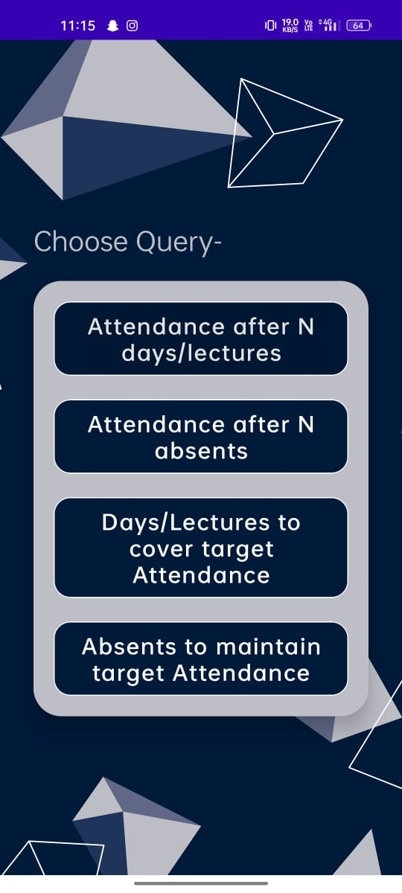
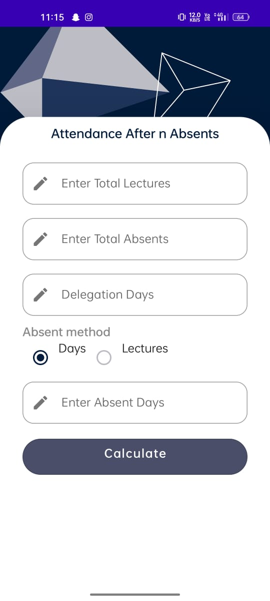
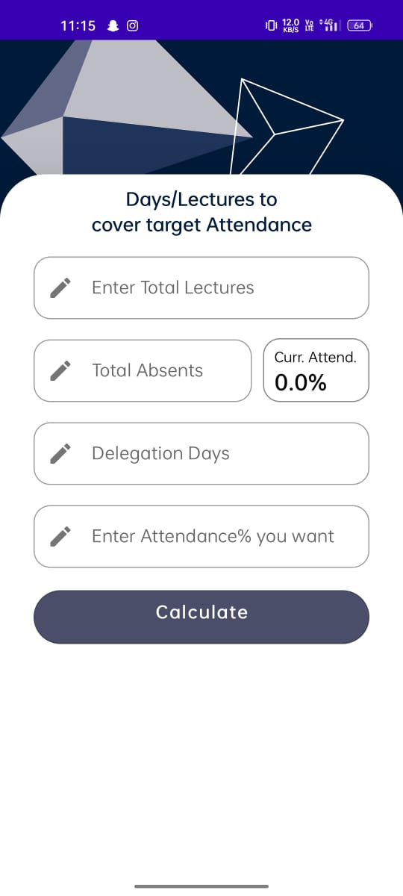

<!-- Improved compatibility of back to top link: See: https://github.com/othneildrew/Best-README-Template/pull/73 -->

<!-- PROJECT LOGO -->
 

  

  <h3 align="center">Attendance Seeker</h3>

  

    Solve every query related to your Attendance!
     
    <a href="https://github.com/its-ks/Attendance_Seeker"><strong>Explore the docs »</strong></a>
     
     
    <a href="https://github.com/its-ks/Attendance_Seeker">View Demo</a>
  

Attendance Seeker is an Android application built using Kotlin and Jetpack Compose. It provides a convenient solution for managing and calculating attendance-related queries.

## Screenshots

| Screenshot 1 | Screenshot 2 | Screenshot 3 | Screenshot 4 | Screenshot 5 |
|--------------|--------------|--------------|--------------|--------------|
|  |  |  |  |  |

| Screenshot 6 | Screenshot 7 |
|--------------|--------------|
|  |  |

## About the Project

Attendance Seeker is designed to simplify attendance management for students, professionals, and anyone else who needs to track their attendance. The application offers the following features:

- Attendance Percentage Calculation: Calculate attendance percentage for a specified number of days.
- Absenteeism Calculation: Determine the number of days needed to reach a target attendance percentage.

## Technologies Used

- Kotlin
- Jetpack Compose
- [Add other relevant technologies or libraries used in your project]

## Getting Started

To get started with Attendance Seeker, follow these steps:

1. Clone the repository: `git clone https://github.com/your-username/attendance-seeker.git`
2. Open the project in Android Studio.
3. Build and run the application on an emulator or physical device.

## Contributing

Contributions are welcome! If you'd like to contribute to Attendance Seeker, please follow these steps:

1. Fork the repository.
2. Create a new branch: `git checkout -b feature/your-feature-name`
3. Make your changes and commit them: `git commit -m 'Add your commit message'`
4. Push the changes to your fork: `git push origin feature/your-feature-name`
5. Open a pull request on the original repository.

## License

[Choose an appropriate license for your project and add details here.]

## Contact

[Add your contact information here, such as your email or other preferred method of contact.]

